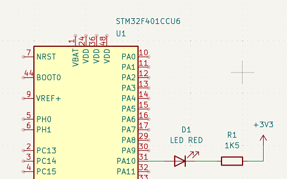
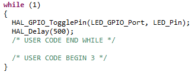
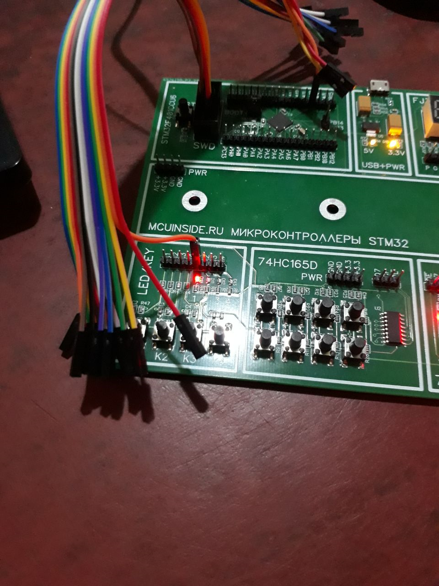

# 1. Введение

## Поставленные задачи
1. Скачать и установить STM32CubeIDE;
2. Запустить программу-мигалку (проверить работоспособность);
3. Нарисовать схему домашки (минимальная обвязка МК, подключение светодиода); 

## Установка IDE
Сама установка у каждого своя, но я её выполнял с использованием файлов, лежащих в архиве.

## Программа мигалка
1. Для того, чтобы программу запустить, нужно её написать. Но для этого необходимо определиться со схемой. 

2. Далее необходимо сконфигурировать проект. В самом начала предстаёт выбор МК. Выбираем STM32F401CCU6. Далее необходимо сконфигурировать сам МК. В этом нам поможет утилита CubeMX. В самом начале мы видим конфигурацию МК и его переферии.

3. Сконфигурируем SWD интерфейс (на самом деле он и так включен, просто не отображается, но мы его выведем, чтобы не забыть), и пин PA10: начальное значение "0", режим push-pull, отсуствие подтяжки, скорость работы медленная. Так же дадим ему метку LED. 

4. Далее мы сохраняем полученную конфигурацию и система генерирует код. После этого пишем простую программу: задержка 500мс и переключение нужного пина.

5. Далее собираем проект и загружаем его на МК. Результат: светодиод моргает.

