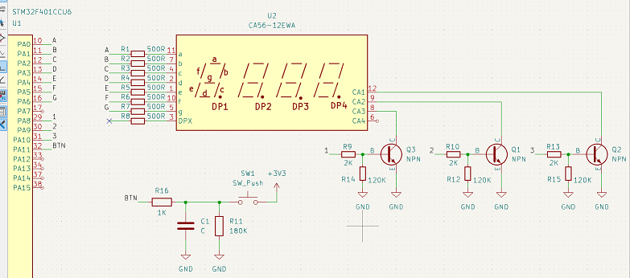
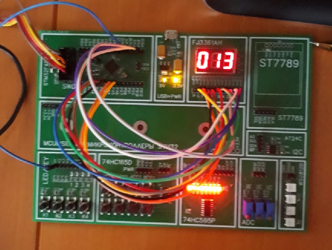

# 2. Структура проекта. GPIO. Прерывания. Дополнительное задание

## Поставленные задачи
1. сделайть счётчик нажатий с выводом насемисегментный индикатор. функции для работы с ним вынести в пару файлов .c и .h

## Переписать проект под кнопку
1. Для начала нужно подготовить полигон для испытаний: подключить сегменты и разряды к соотвествующим пинам

2. Далее необходимо создать проект и сконфигурировать необходимые выводы. И после сгенерировать код. После начинается написание самого модуля

3. После некоторых попыток было принято решение создать 2 структуры: 1 отвечает за сами порты и пины, содержит маски для стирания старых данных, а так же имеет массив выводов для разрядов и словарь соотвествия комбинаций сегментов и цифр

Вторая отвечает за хранение массива зажжённых сегментов, числа сегментов, а так же числа, которое сейчас отображается. Это позволит не пересчитывать каждый раз одно и то же число, а сразу выводить его

4. Далее необходимо написать функции инициализации нужных портов и пинов, разбиения числа на массив цифр и перевода в набор зажигаемых сегментов, а так же сам вывод этих сегментов. Но перед этим переименуем функцию init_led в init_gpio_out(в будущем будем именно так и делать, а функции, похожие на зажечь светодиодик, будем зажигать с помощью передачи структуры с портом и пином).

5. На стадии онициализации происходит вычисление масок, которые будут использоваться для инициализации портов и пинов, отвечающих за разряды и сегменты, а так же они используются для выключения всех пинов после отображения нужного числа в нужном разряде.

6. Разделение числа происходит стандартно: записываем последнюю цифры, стираем последнюю цифру, и так 3(число сегментов) раза, при этом записывается не само число, а набор пинов, необходимых для зажигания данной цифры.

7. Отображение цифры банально: обнуляем все сегменты и разряды, и зажигаем нужные

8. Отображение числа тоже не вызывает сложностей. Сначала проверяем, не изменилось ли число, и если да, то пересчитываем набор. А дальше в цикле зажигаем нужную цифру и включаем нужный разряд. Делается это с задержкой ~5мс. Данную функцию нужно вызывать во внешнем цикле.

9. Настройку кнопки уже не показывать не стану, так как там в целом уже отработано. Только не понял как колбек прерывания нормально вынести в отдельный модуль, так как он используется и кнопкой, и 7 сегментником.

10. В инициализации мы присваем массив пинов разрядов, массов словарь цифр, прописываем порты, и так далее. В конце просто вызываем нужную функцию.

11. В самом цикле мы просто зажигаем нужное число. 

12. Результат: мы видим число нажатий.

Жду замечания и предложения, а то хочется делать более менее нормально, по мере знаний так сказать
И в целом интересно, какие файлы нужны, а какие можно закинуть в гит игнор?