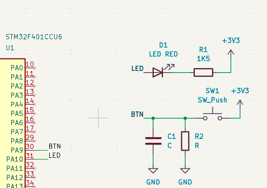
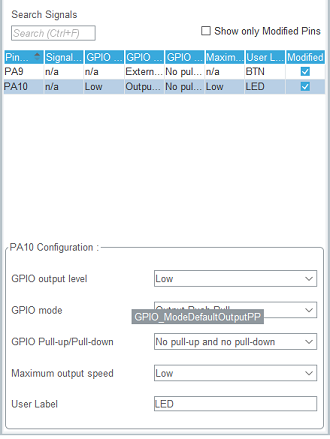
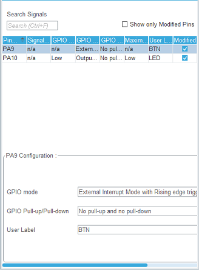
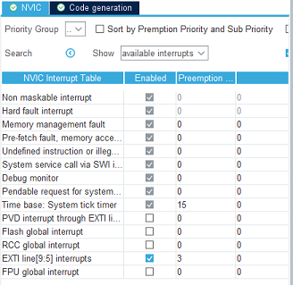
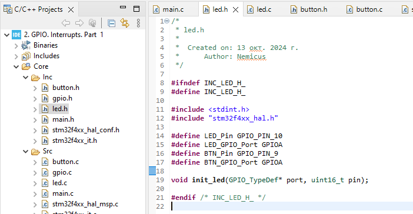
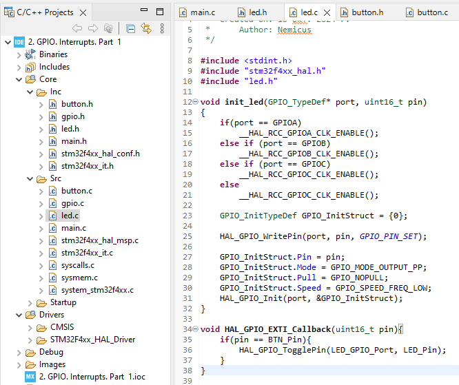
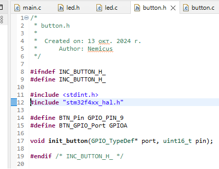
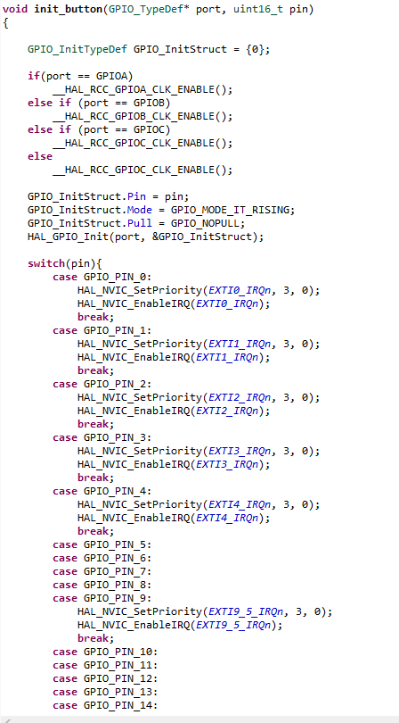
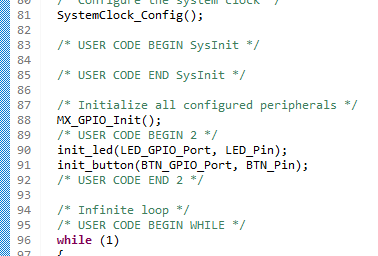

# 2. Структура проекта. GPIO. Прерывания

## Поставленные задачи
1. Перепишите ДЗ с прошлого урока так, чтобы светодиод переключался по прерыванию при нажатии кнопки.
2. Вынесите в отдельный файл функции инициализации светодиода (void init_led(GPIO_TypeDef* port, uint16_t pin)) и обработчик прерывания.

## Переписать проект под кнопку
1. Для того, чтобы добавить кнопку, её нужно подключить

2. Далее создаём проект и настраеиваем необходимые пиныЖ PA10 - LED, настраивается как GPIO-Output, PA9 - BTN, настраивается как GPIO-EXTI9
3. Настраиваем LED вывод:

И вывод BTN: без подтяжки и прерывание по подъёму сигнала

4. После настраиваем NVIC контроллер (пусть будет приоритет 3)

5. Итог: светодиод переключается по нажатию кнопки.

## Вынести модули инициализации светодиода и обработчика прерываний

1. Сама инициализация светодиода состоит из включения нужного порта и конфигурирования соттветствующего пина. Но для начала необходимо создать пару файлов led.h и led.c, в которых будут лежать соотвественно прототипы и реализации функций. Оба файла должны включать в себя библиотеку HAL для определения типа данных GPIO и stdint для фиксированных типов. В файл "led.c" так же положил колбек прерывания

2. Похожую процедуру провёл и для инициализации кнопки

3. После сгенерированной инициализации поместил свою

4. Итог: светодиод так же переключается по прерыванию нажатия кнопки