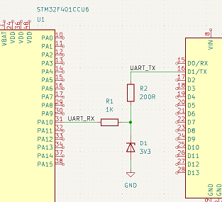

# Асинхронные интерфейсы. UART

## Задание
1) Реализуйте обмен данными по UART МК STM32 и платой Ардуино (или другим STM32 — как удобно). Например, пусть при нажатии на кнопку, подключённую к Ардуино, зажигается светодиод, подключённый к STM32, и наоборот.

## Управление STM32 платой Arduino посредством UART
1) Основная проблема управления платой STM32 с помощью платы Arduino является разность рабочих уровней: 3.3В и 5В соотвественно. Потому необходимо было сделать схему одностороннюю для согласования уровней. Выбран был такой вариант(резисторов для делителя под рукой не было).

2) Далее необходимо настроить сам блок UART: включить сам блок, разрешить прерывания. И настроить его только на приём(хотя это не обязательно).

3) Далее необходимо включить приём по UART неблокирующий. В коде есть 2 варианта: приём с помощью текста, если команда вводится человеком, или с помощью кодов, для платы Arduino. Выбор осуществляется с помощью макроса IDLE

4) Так же необходимо реализовать как чтение команды, так и её выполнение. Данные функции описаны в файле command.c

5) В самом прерывании поднимается только флаг, основная обработка идёт именно в основном цикле(хотя условия позволяют всё это осуществлять прямо в прерывании)

6) Для самой платы Arduino используем такую программу

7) Результат: по команде из платы Arduino можно мигать светодиодиком как по кнопке, так и периодически.