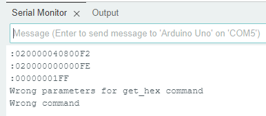

# Асинхронные интерфейсы. USB

## Поставленная задача
Реализуйте передачу запрошенной области адресного пространства по USB в формате Intel HEX.  
Например, на запрос  
`get_hex 8000000 2`  
должен быть ответ:  
`:020000040800F2`  
`:020000000000FE`  
`:00000001FF`  

## Обмен между МК и компьютером
1. Сам обмен по USB осуществляется с помощью предоставленных библиотекой функций и колбеков. Однако сами по себе эти функции и колбеки можно модифицировать. Я попробовал избежать глобальных буфферов и флагов, и поступил таким образом: 

Создал тип структуры, которая хранит флаг окончания приёма и указатель на приёмный буффер

Статически определил структуру результата приёма

И создал функцию, которая возвращает адрес на данную структуру. Теперь у меня есть более контроллируемый способ к получению буффера и статуса приёма. Далее инициализировал буффер в основном цикле и передал указатель на буффер в саму структуру.

2. Далее модифицировал колбек приёма. Она получает структуру с буффером и флагом, поднимает флаг и записывает принятые данные в буффер структуры (хотелось бы, чтобы указатель получал стркутуру только 1 раз, но статик не работает, или я чего-то не знаю)

И модифицировал функцию _write, чтобы воспользоваться функциям стандартного вывода.

3. Далее начинается самое весёлое: чтение команды и её выполнение, или же, выдача нормальной ошибки

Чтение команды идёт в 2 этапа: распознавание самой команды, и получение пораметров команды(там выдаётся структура, которая содержит саму команду, начальный адрес, и количество байт для манипуляции. Хотя сама команда и не нужна, но это уже наследие старой парадигмы, когда ты читаешь команду из строки и формируешь стрктуру, а потом выполняешь команду по самой структуре. Тут это наверное излишне, но было уже влом переделывать)

Ну и сама структура

4. Алгоритм выдачи INTEL HEX построен так: есть функции построения строки старшего байта адреса, строки с данными, и получения чексуммы байтов, которую оспользуют обе предыдущие функции. Данные функции приведены в parse_command.c (скрины получаются большие потому так)

5. Сама обработка в мейне происходит стандартно: 

6. Результат:

