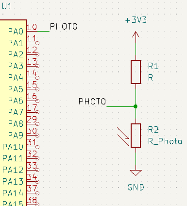

# Аналоговый блок

## Задание
1) Сделать дневной автомат с помощью АЦП. Выводить значения АЦП по USB или UART
2) Попробовать сделать автомат с помощью WatchDog Mode

## Дневной автомат
1) Первым делом нужно подготовить схему. Подключение светодиода стандартно, как и USB.

2) Сами настройки АЦП стандартные, только включил Continious conversion mode, так как мы будем работать на нём постоянно(только насколько я понял, его надо постоянно всё равно включать, или я чего-то не знаю). Так же включил LED_PIN. Настройка для него стандартная. Приоритеты выбрал равные, так как хочется сохранить чтобы никто никого не прерывал (хотя может я и не прав)
UPD: всё равно USB и АЦП вместе особо не уживаются.Только если запускать АЦП каждые 10 мс.(С одной не пробовал, и смысла для данной задачи особо нет)
3) Как было сказано выше, работа шла в прерывании. Сделаны функции обёртки для того, чтобы не выносить структуру hadc наружу.(хотя может и стоит её выносить, чтобы выйграть в производительности).
4) Настройка USB была сделана аналогична предыдущему ДЗ. Ну и переопределена функция _write, чтобы можно было пользоваться стандартным выводом.
5) Перерасчёт решил не делать. Вместо этого решил сразу работать с абсолютными значениями АЦП, так как вольты нам не то чтобы и важны. Скорее важна относительная величина.
6) В прерывании сделан выбор значения для LED с помощью гистерезиса.(с выносом порогов в инициализацию возиться не стал, вполне можно сделать через DEFINE).

# WatchDog Mode
1) Для данного режима нужно нажать галочку WatchDog Mode Enable. Далее нужно настроить пороги. У данного режима свой колбек, но принцип работы для данной задачи не меняется.