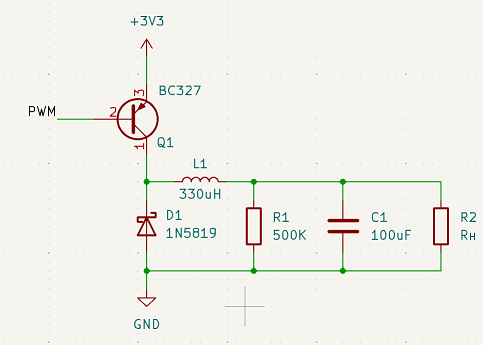
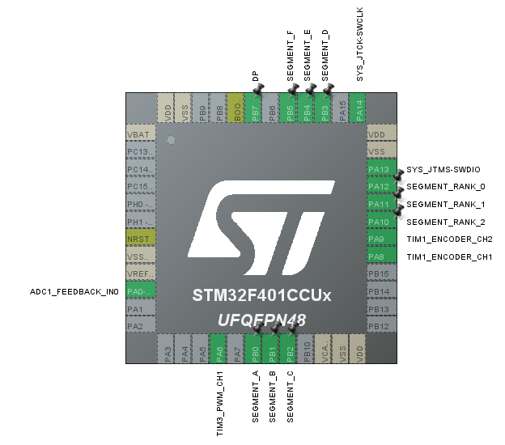

# Курсовой проект. Источник питания

## Задание
1) Сделайть стабилизированный источник регулируемого напряжения. Для настройки можно использовать потенциометр, энкодер, кнопки или данные от другой платы (скажем, ардуино, выполняющей роль интерфейса — через UART или SPI). Уставку и обратную связь по напряжению вывести на экран, подключённый к stm или ардуино.

## Подготовка
1) В качестве основы использовал схему DC-DC step-down преобразователя. На роль ключа выбрал pnp транзистор BC-327-40, так как на нём доступен весь диапазон напряжений, в отличии от транзистора npn(0...Vmax-0.7В).

2) Для индикации использовал 7сегментный индикатор. С ним понятно как работать + есть готовая библиотеку(правда пришлось её переделать для работы с дробными числами)

## Реализация 

1) Конфигурация пинов представлена ниже. Для генерации шим использовал таймер 3. Этот же таймер служит для запуска АЦП. Тем самым экономим таймеры и само регулирование синхронно с ШИМ. Ещё 1 таймер служит для динамической индикации. Регулирование идёт по завершению работы АЦП(но тут не знаю, возможно лучше сделать чтобы по апдейту таймера)

2) Сам таймер 3 использовал без делителя, так как нужна одновременно высокая частота для уменьшения пульсаций, и большое число возможных значений CNT для более точной подстройки. 

3) Реализовать PID регулятор можно было 2мя путями: статические переменные и структуры. Вариант со статическими перменными более красивый, однако данным регулятором можно регулировать лишь что-то одно. Вариант со структурами менее красивый и требует отдельного типа. Однако данным вариантом в одном проекте можно регулировать 2 разные вещи. нужны лишь 2 структуры. Выбрал вариант 2.

4) Так же был сделан отдельный модуль фильтрации. По похожему принципу. Коэффициент выбрал не слишком большим, так как питание не имеет тенденции быстро меняться

5) Сама регуляция происходит по завершению работы АЦП. Сначала значение со входа фильтруется, потом уже используется как обратная связь. Использовал только пропорциональную составляющую. Для решения основной задачи этого оказалось достаточно.

6) Для испытания в качестве нагрузки использовал подстроечный резистор на 1(кОм) и последовательно подключённый на 100(Ом) в качестве защиты.(Там последовательно стоит линейный преобразователь на 3,3В. МК пока нужен и потому рисковать не хочется).

7) Результат: получился регулируемый источник питания, способный держать напряжение при разной нагрузке. Видео прилагается в папке с домашними работами